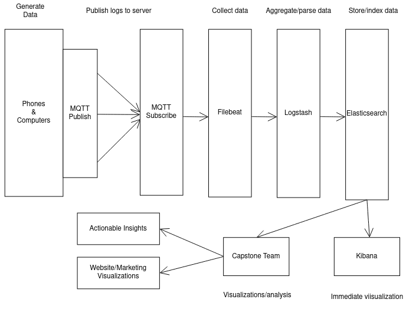

# Project Update 1 (2/4/2022)

### **Motivation and Goals**

As you already know, Allthenticate is a cybersecurity company which allows users to simply authenticate using their phones. As you can imagine, the amount of (very sensitive) user data Allthenticate generates is huge. However, that data is currently not being utilized for any business purposes. So, why not join forces with a talented and passionate group of Data Science students? Though having data available for analysis is not the only motivation behind this project, it is an important one.

Additionally, the company wants to truly understand its users to improve their experience with the app. Allthenticate was founded in 2019, so it is a fast growing, young company with a motivated team behind it. Although Allthenticate are in close contact with most of their clients, the company lacks a deeper understanding of how the general user interacts with the product. How many times are users typing their passwords? How many times do they need to open the app? What settings are they using most often? 

The primary objectives of this project are being able to quantify the benefits that our security solution provides as well as improving the Allthenticate user experience. To achieve this, we have two main areas of focus.

First, we want to quantify how much of an improvement Allthenticate’s security solution provides as opposed to existing solutions. This includes tasks like measuring time saved by using Allthenticate, tracking changes in bluetooth connection, and monitoring app status. This will all be done by analyzing the user data provided by the logs from readers, as well as the phone and computer apps.

Second, we intend to increase how well the product is working. Allthenticate is constantly improving and with user-happiness being at the core of the company’s values, we want to cater the best experience for the user. An example of this could be predicting a user’s app behaviors to personalize their UI to give them the most seamless experience for their particular needs. 

As a final goal for the team, and extension of our second goal, we would like to publish an academic publication at a top tier conference focused on user-happiness and usability of the app. The company is serious about being a simple solution for all and we hope to prove ourselves by analyzing user-data in an academic context.

 
### **Data**

**Important Terms**

* **ELK**: Elasticsearch, Logstash, and Kibana running together

* **Elasticsearch**: open source, JSON-based search engine and storage systemetc.) on assigned readings

* **Logstash**: open source, filtering and aggregation software for logs

* **Kibana**: open source, browser-based visualization dashboard

* **MQTT**: real time lightweight IoT communication protocol

* **Filebeat**: lightweight log forwarding software

There are two main datasets we will be using to analyze user statistics and Allthenticate’s usability. 
The first dataset is a collection of logs from the door readers and computer software that Allthenticate has stored in MongoDB. This data was collected using HTTP posts to the server running MongoDB. We do not yet know the structure of this data.
The second dataset is a separate collection of logs, this time from the app running on the phones. This data is stored in a server running Elasticsearch, with a Kibana dashboard for live visualization and log tracking. This data was collected from the phones using the MQTT IoT communication protocol, where there is a client running on every phone that connects to a broker running on a server in order to send the logs. Once these logs reach the MQTT broker, they are forwarded to the Elasticsearch server instance using Filebeat. Before they reach the server, they can be filtered and modified using Logstash. This infrastructure is modeled below. 

<em>Figure 1. Model of logging infrastructure for phone data.</em>

 

This data comes in two forms, both in JSON format. The first type of data is logged when there is an action on the phone taken by the user. This data contains the phone's unique ID, the action taken, and the time. This data tracks when the user opens the app, when they close it, when they turn bluetooth on or off, and when they lock or unlock a door or computer. This format is shown below

Phone | Action | Time
---|---|---
7564cf90-5d27-423b-caddb46 | lock | 2022-01-28 04:47:23.957818
7564cf90-5d27-423b-caddb46 | ble enabled | 2022-01-28 00:12:31.482374
 
The second type of data is information that the phone stores about all of the door readers and computer that it connects to. This data is updated whenever the information for this device changes from the phone’s perspective. This data contains fields for the phone’s unique ID, the time, and then the device info of the device. This device info includes fields for the type of device it is (1 for door, 2 for computer), whether it is locked, whether it is connected, whether it is processing a command, whether it is connectable, whether it is communicating, the unique ID for the device, and the strength of the signal from the device. This data is shown below.

Phone | Time | Device Type | Connected | Connectable | Locked | Connecting | UUID | RSSI
---|---|---|---|---|---|---|---|---
471bf5ea-887b-4eaf-8324 | 2022-01-28 00:01:40.798130 | 1 | true | true | false | false | 10f9ef4-14fc-42a7 | -51

### Current Progress 

At the current moment, we are still setting up our workflow with the datasets being able to reliably access the data. The company is implementing a logging system from the ground up for the first time in order to generate our data, resulting in a slow start to getting the ball rolling on tangible datasets so that we can start exploratory analysis. Still, we are keeping busy by brainstorming trends/insights we can measure with our data, as well as writing documentation to properly interpret the features in our datasets.