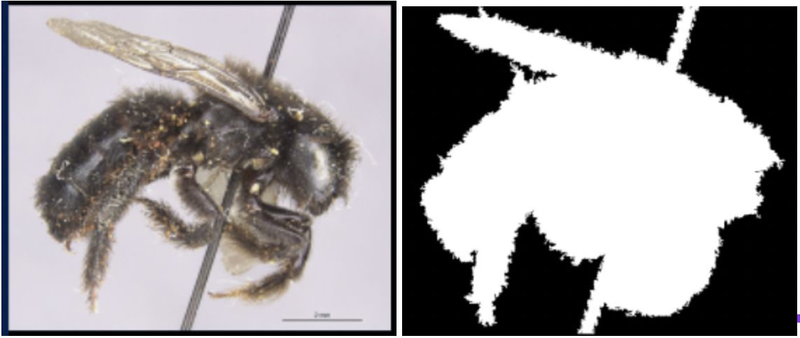
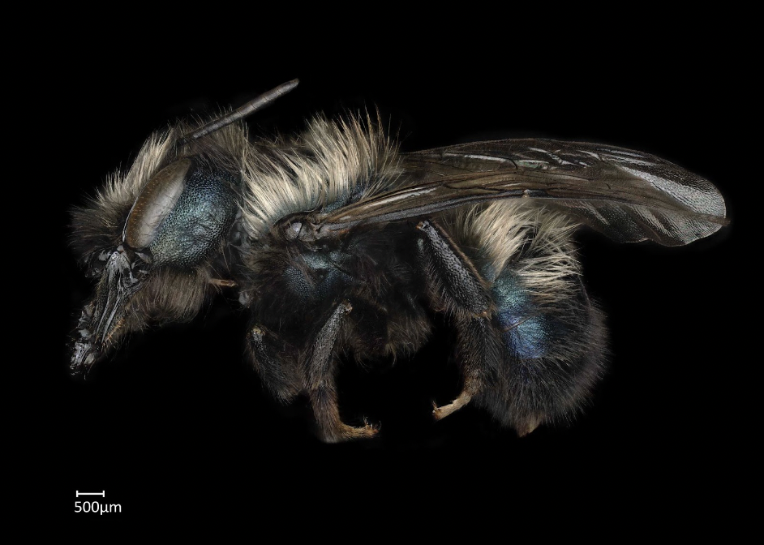
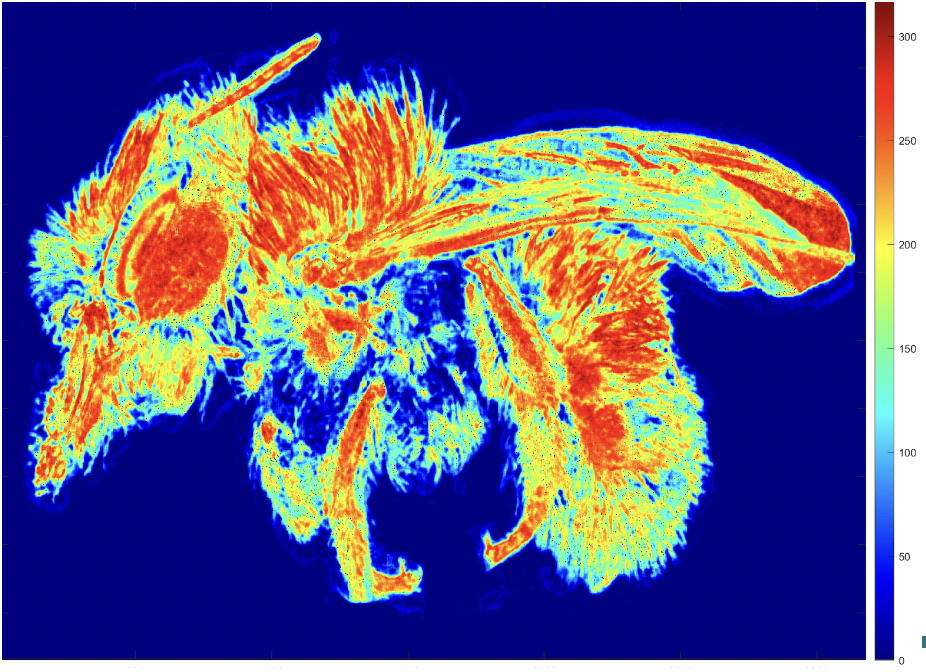

# Update 3

## Progress Check
For the past month, we focused on two different methodologies to quantify bee hairiness. We begin by creating a dataset from the bee images provided by the sponsor. This dataset will be the images used to train our models. One first method (hair segmentation approach [insert link] required the use of bee masks. From the provided 550 images, we wanted to create a methodology for masking the bees. The purpose of masking is to have the hair segmentation model learn what is considered bee vs. not bee. Since our end goal is to quantify the amount of hair on a bee, it is important that our models know where and what to quantify. 

## Challenges
In an attempt to create a binary mask indicating bee and no bee for the ground truth, we tried to create a model using OpenCV to automate this process. However, we found that this model consisted of a lot of error and would misclassify where the bee is. For example, if an image had a lighter background with a light colored bee, the entire image would be masked white, indicating that it was all bee. Another problem with creating the binary masks is that some continuous regions that are not part of the bee would be classified as a part of the bee.

|  |
|:--:|
| <b>As shown above, the closed regions were mistakenly classified as part of the bee and the pin was not removed from the mask</b>|

Since the previous approach produced a lot of errors, we decided to manually mask the bee images using photoshop. Although this method is quite time consuming, we believe that it is the best way to construct an accurate ground truth for our machine learning models to learn on. 

|  |
|:--:|
| <b>Manually photoshopped hairs</b>|

Furthermore, we will be able to assess the accuracy of our models more efficiently. For the hair segmentation approach, we also have to create a ground truth indicating where the bee hair is on the image. For this step, we are also using photoshop to mask the bee hairs. Through these methods, we will be able to train our model, and clearly quantify the hairiness on the bee images. 

|  |

|  |

## Entropy Approach
* Variable performance of the metric
  * After extensive research on segmentation models, we’ve decided to proceed with the U-Net architecture. This architecture is named after its structural design, as it is U-shaped, with the first half encoding the dataset, and the second half decoding an image to a masked image. The model is fully convolutional, so we don’t have to worry too much about resizing images before training. Each component of the decoder is connected with its symmetric twin, so part of the decoder’s learning process is to learn from the encoder’s weights. 

* Lack of dataset size
  * One major drawback to using a neural network is the lack of size in our dataset. With only 550 raw images to work with, we’ll have to work with augmentation techniques, such as flipping and slicing to expand the size of our dataset. Even doing such, we’re left with a relatively small dataset and were left unsure if the model will train efficiently.
  
# Future works/Goals
For the entropy method, we have been provided with a small subset of test images with bees categorized by apparent level of hair into four groups (low, medium-low, medium-high, high). We intend to compare this set to the binned results of the entropy program and evaluate for any inconsistencies. Within each binned set, we want to evaluate the values assigned to the images relative to all other images in the dataset. 

We will attempt to remedy the faults of the program by gaining some insight into the reasons why the entropy program performs well with certain images and poorly with others. The intended output would be a list of values representing the average entropy value for each image.

For our neural network approach, we will familiarize ourselves with the tools used for transfer learning and begin building some prototypes. We will want to maintain larger image sizes during training, in order to preserve smaller pixel regions of individual hairs. Given the size of our dataset, the smartest move would be to apply transfer learning. There are already many sophisticated pretrained segmentation models published for the open to use. With the power of transfer learning, we’re able to continue training these models with our own dataset to get better results. Additionally, there are tools available for turning other segmentation models into a U-Net, by creating a decoder for the model. With these methods now discovered, we’re able to focus on using many sophisticated pre-trained models with our dataset as opposed to building them from scratch.

For these approaches, we want to construct models and assess an accuracy metric that is descriptive and meaningful. In this way, we will be able to compare different methodologies and discuss the outcomes effectively.
