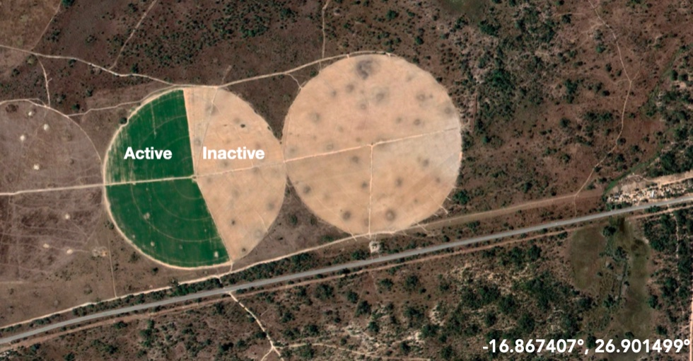

## Update 1 

**Project: Combining computer vision and satellite imagery to map agricultural investment and water use in sub-saharan africa**

### Our sponsor

The *[Earth Research Institute (ERI)](https://www.eri.ucsb.edu)* at UCSB spans areas covering natural hazards, human impacts, earth system science, and earth evolution by collaborating across interdisciplinary departments on campus. Under the guidance of Kelly Caylor (Director of ERI), we are undertaking a project to improve food security by making water and irrigation equipment more accessible.
### Motivation & Background
Irrigated agriculture is expanding rapidly across southern Africa. Because this expansion is occurring without much regulation or monitoring, it’s not exactly clear where and when expansion is happening, or the fate of expanded agriculture. In most expansionary cycles, there is a boom-and-bust dynamic, where many investments fail quickly and only a few persist. We’re interested in mapping these dynamics over the past 5-10 years across southern Africa and monitoring them going forward.
### Project Goals
- [ ] In order to track this on-going ***agricultural gold rush***, we need to be able to resolve individual fields as objects. This means that instead of simply identifying pixels containing agriculture [pixel-wise classification](https://www.mdpi.com/2220-9964/7/3/110), or finding all the areas containing agriculture [semantic segmentation](https://www.jeremyjordan.me/semantic-segmentation/) we want to segment individual fields within an image [instance segmentation](https://towardsdatascience.com/single-stage-instance-segmentation-a-review-1eeb66e0cc49)
- [ ] In addition, we want to know if fields are actively being used or not. This means we need to generate distinct labels for active and inactive center pivots. 
- [ ] While models have been trained on coarse-resolution satellite data, there have been few attempts to use very high resolution imagery for mapping agriculture with computer vision 
- [ ] Our project will set up the necessary infrastructure, generate appropriate label data, and disseminate/use that data for training cutting-edge computer vision models that can be used to monitor and map agricultural expansion and irrigated water use across southern Africa (and elsewhere!). 
### Our data
We plan to use the labeling interface that we will implement to generate datasets of irrigated farmland in Zambia.
The planned dataset will consist of labeled satellite images of central pivot irrigated farmland. One possible example of this data is below.  


### Current Work
We are currently working on setting up an image annotator web service. The data that we have is currently **unlabeled**. We want to be able to identify *center-pivot irrigated farms*, therefore we need data that has these center-pivots clearly annotated. We want to be able to set up an instance of [Label Studio](https://labelstud.io/guide/install.html) on an ERI server. Label Studio will enable us to efficiently label the image data. The service instance should have a port exposed to allow connecting to it externally. We will then work on annotating our data.
```{note}
**Center-pivot irrigation**
This is a effective method of crop irrigation in which 
See **center-pivot irrigation** in action! 
[](https://youtu.be/2bILpvH3EuQ)
```

